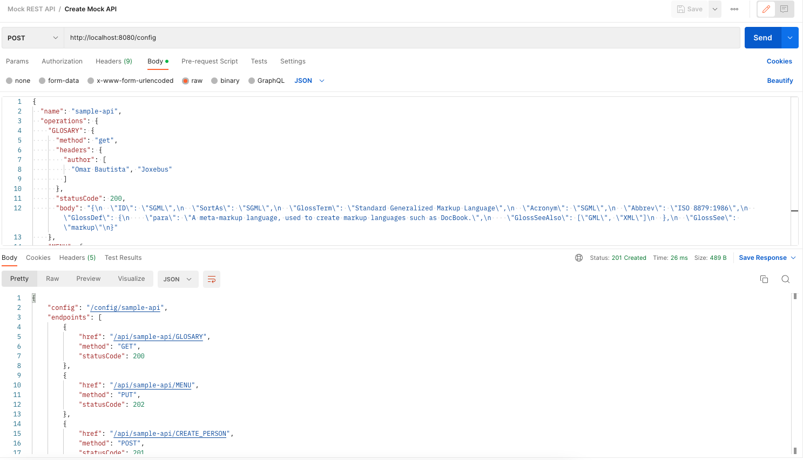
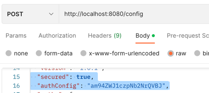
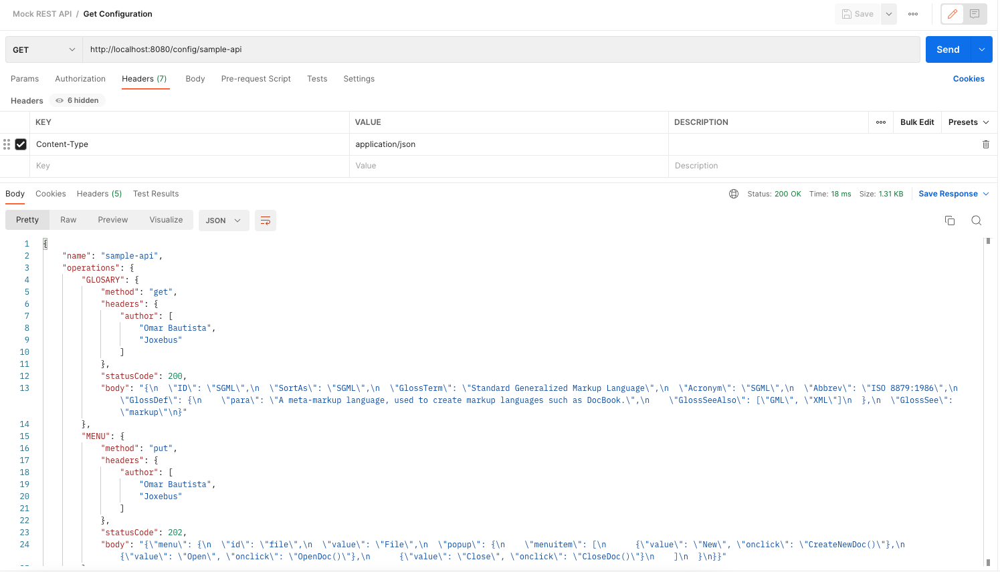
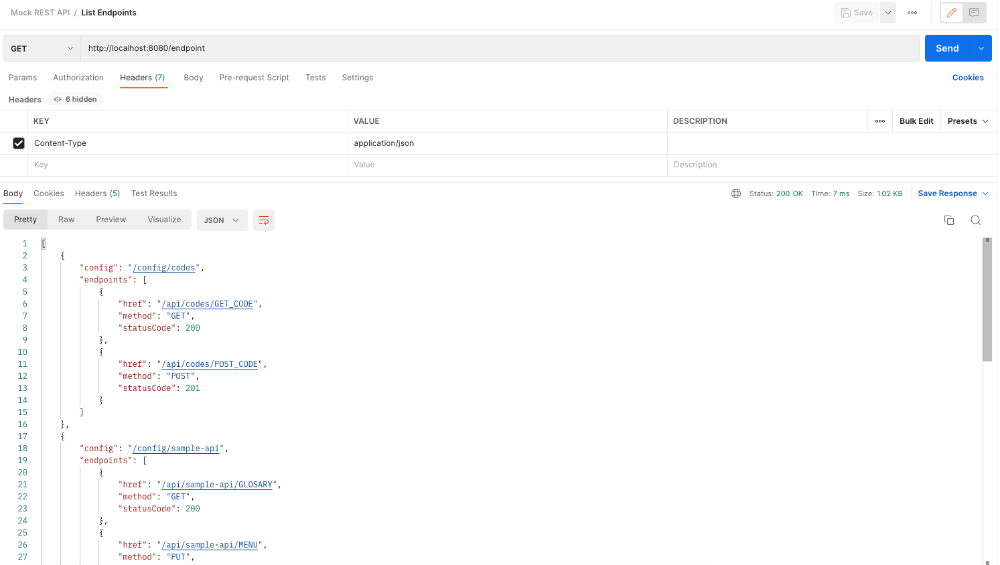
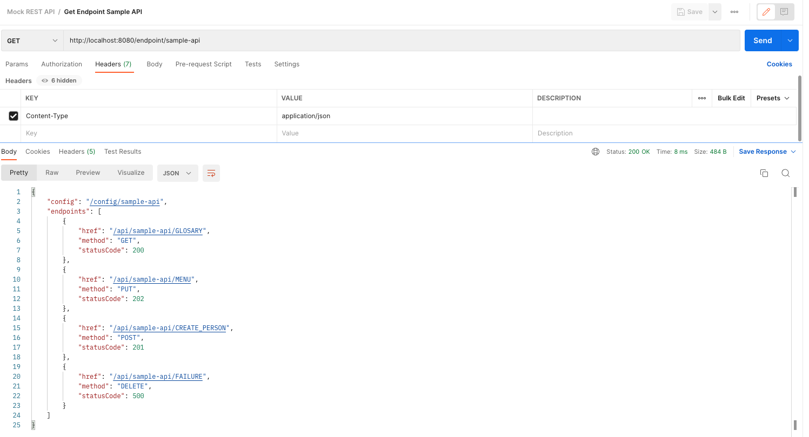
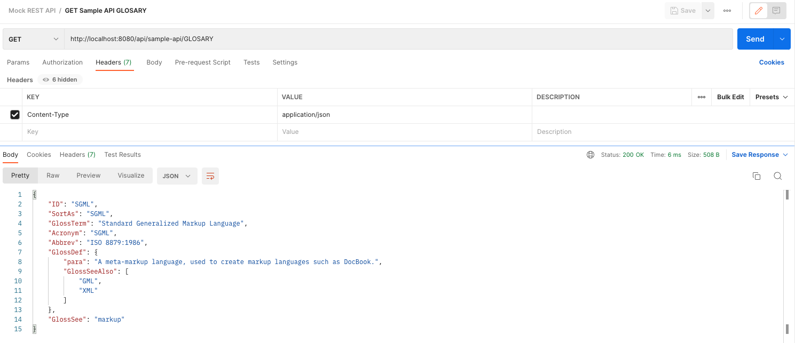
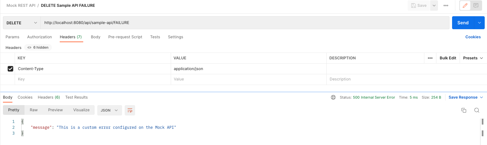

# How to use Mock REST API

Mock REST API provides some operations to interact with it. This application
read the configuration from files in your file system (for now!)

- `/config` 
  - `POST`: creates a new API configuration and save it in **YAML** format, 
  you can configure the directory in the **application.yaml** or with 
  an **env** variable called `FILES_UPLOAD_FOLDER`
  - `GET`: returns the raw data of the API configured `/config/{apiName}`
- `/endpoint`
  - `GET`: **without** path variable will return the list of available endpoints of all APIs
  - `GET`: **with** path variable will return the endpoints for only selected API `/endpoint/{apiName}`
- `/api`
  - `GET | POST | PUT | DELETE | PATCH`: Method depends on the API configuration and each endpoint
  - `/api/{apiName}/{operation}`: As in the [sample-api.yaml](assets/samples/sample-api.yaml "API Configuration Sample")
  you can call for example `/api/sample-api/GLOSARY` and the method should match in the request.

### Postman Collection

A postman [collection](assets/samples/Mock_REST_API.postman_collection.json "Mock REST API Samples") has been provided, you can find it inside the `assets/samples` folder.

### Configure endpoints

Create API configuration

MockAPI support auth configuration, please refer to the Postman collection to see
the samples, when `secured` is set as true you need to specify the `Authorization` header on your
request with the password set on your configuration.

Show API configuration

### Show endpoints

List endpoints

Show specific endpoint

### Calling mocked API

Sample GET

Sample Custom Error
